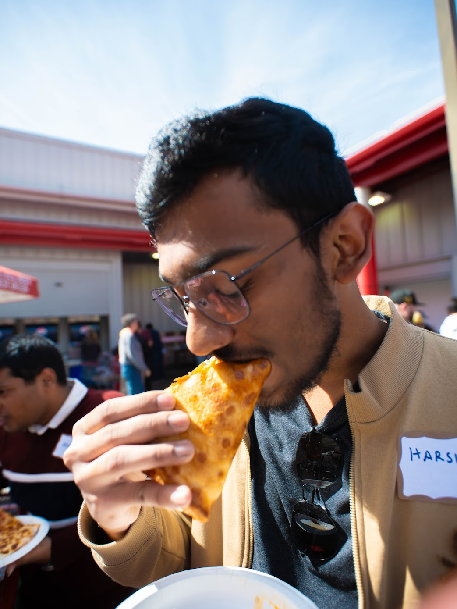
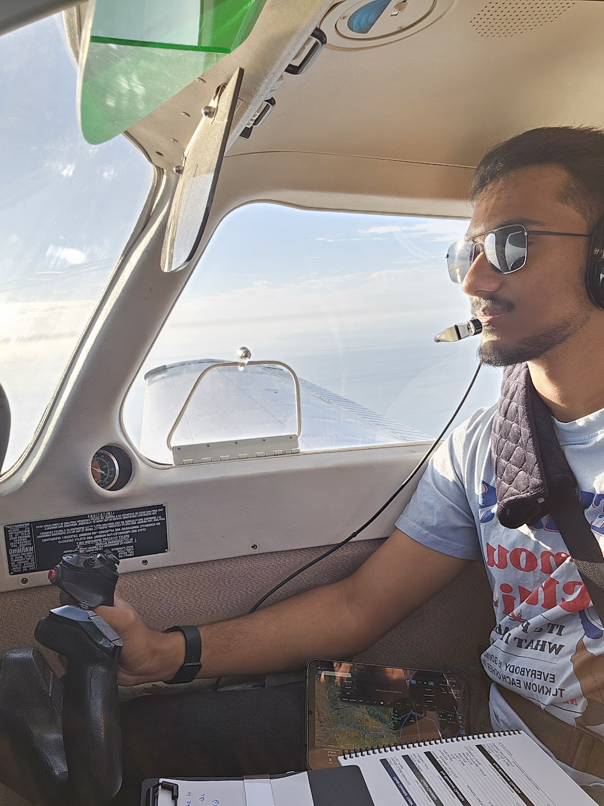

# Sriharsha (Harsha) Kavuri

## [**Submission Repo**](https://github.com/kavurisriharsha/cse110-lab1)
[About Me](#about-me) · [My Projects](#my-projects) · [My Interests](#my-interests) 

---

<!-- setting the images size to be somewhat reasonable using html-->




## About Me
I am a **Computer Engineering** student in the *ECE* department at UCSD. What this means is that I get de-prioritized come enrollment time. <small> yay </small>

I am currently a **Sophomore** and I am taking [CSE110](https://catalog.ucsd.edu/courses/CSE.html#:~:text=CSE%20110.%20Software%20Engineering), [CSE120](https://catalog.ucsd.edu/courses/CSE.html#:~:text=CSE%20120.%20Operating%20Systems%20Principles), [CSE141](https://catalog.ucsd.edu/courses/CSE.html#:~:text=CSE%20141.%20Introduction%20to%20Computer%20Architecture), and [CSE141L](https://catalog.ucsd.edu/courses/CSE.html#:~:text=CSE%20141L.%20Project%20in%20Computer%20Architecture). If you couldn't tell, I am a big fan of Systems and Architecture.

My mother tongue is **C** but I am also chill with **Python** and **Java**. 

<small> 
<a href="https://github.com/mtfn/diamondhacks/blob/dockerize-it-all/challenges/setup.c">
I wrote this in C when it could be trivially done in `bash` cuz why not
</a> 
</small>

</br>

I am currently a *CSE29* tutor and a researcher in the CS Education Research lab under *Prof. Leo Porter*.

---

## My Projects
Most of my projects are private at the moment so this will be a bit sparse, but here are some that I am currently working on:

### [TU154 for MSFS](https://github.com/kavurisriharsha/tu154msfs/tree/main)
 This is a project to port the TU154M aircraft from X-Plane to MSFS. I am currently working on the autopilot and flight dynamics.

I'm writing it entirely in C because the original code is in Lua and Lua code looks like this:

```lua
function get_ias()
    local ias = 0
    if (get("sim/flightmodel/position/groundspeed") > 0) then
        ias = get("sim/flightmodel/position/indicated_airspeed")
    end
    return ias
end
```
*Disgusting.*
<small> it is also 1 indexed btw</small>

#### Task List
- [x] Electrical System
- [x] Hydraulic System
- [ ] Autopilot
- [ ] Flight Dynamics
- [ ] 3D Model
- [ ] MSFS Integration

---

## My Interests
> With the stick in my right hand, the throttle in my left, and the rudder beneath my feet, I can savor essence from which life is made. ~ *Stephen Coonts*

I am a huge avgeek and a I hold a private pilot license. I am also the President of the Triton Aviation Club at UCSD. 



I am also a huge gamer. I'm gonna put the games I play here(in an ordered list ranked by hours played) so that I can look back at this and cringe at my choices.

1. [Microsoft Flight Simulator](./images/msfs.png)
2. [BeamNG Drive](./images/beam.png)
3. Valorant
4. My Summer Car
5. Cities Skylines


<small>
fin.
</small>

---
